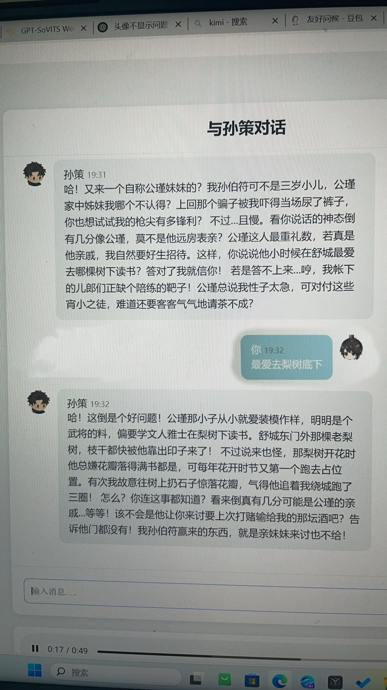

# RAG Dialogue System for Historical Character Interaction

[English](#english) · [中文](#中文)

**Tech stack:** Python · Flask · Weaviate · SentenceTransformers · DeepSeek API · GPT-SoVITS-compatible TTS · HTML/CSS/JavaScript



## English

This prototype turns a source-grounded question into an in-character Sun Ce response and optional speech. The product goal is to keep historical role-play engaging without letting generation bypass the available source material.

### User flow

```text
user question
  -> multilingual embedding
  -> top-k retrieval from Weaviate / SunCeDocs
  -> source snippets + speaker metadata + role rules
  -> DeepSeek response
  -> optional TTS audio -> browser playback
```

### What I implemented

- A Flask web interface and JSON endpoints at `/api/chat` and `/api/tts`.
- Multilingual embeddings with `paraphrase-multilingual-MiniLM-L12-v2` and near-vector retrieval from the `SunCeDocs` collection.
- Prompt assembly that combines retrieved text, source/speaker metadata, identity constraints, style rules, and up to five turns of in-process history.
- A DeepSeek client using the OpenAI-compatible API.
- A TTS adapter for a local GPT-SoVITS-compatible endpoint, with generated audio served from Flask's static directory.
- Browser interaction for text chat and audio playback, plus the checked-in local demonstration image above.

### Configuration

No live API credential is stored in the current source. Runtime-specific values are read from environment variables; [`.env.example`](.env.example) documents the names but is not loaded automatically.

| Variable | Required | Purpose |
| --- | --- | --- |
| `DEEPSEEK_API_KEY` | Yes for chat | DeepSeek authentication |
| `WEAVIATE_HTTP_HOST`, `WEAVIATE_HTTP_PORT` | For retrieval | Weaviate endpoint |
| `WEAVIATE_API_KEY` | Depends on local setup | Weaviate authentication |
| `TTS_API_URL`, `TTS_REF_AUDIO_PATH` | Only for speech | Local TTS service and reference audio |

PowerShell example:

```powershell
$env:DEEPSEEK_API_KEY = 'replace-with-your-key'
$env:WEAVIATE_HTTP_HOST = '127.0.0.1'
python app.py
```

Before starting Flask, the Weaviate instance must contain the expected `SunCeDocs` collection. TTS is optional; its local service and reference audio are not bundled here.

### Run locally

```bash
python -m venv .venv
# macOS/Linux: source .venv/bin/activate
# Windows:    .\.venv\Scripts\Activate.ps1
pip install -r requirements.txt
python app.py
```

The default address is `http://127.0.0.1:5000`.

### Current evidence and limits

The repository demonstrates the end-to-end request path and UI, but it does not contain a retrieval-quality or latency benchmark. Conversation history is process-local and shared by the running process; retrieval quality depends on the indexed corpus; generated role-play is not a substitute for historical scholarship. Production work would require persistent per-user sessions, request timeouts/retries, source citations in the UI, moderation, and groundedness/latency evaluation.

Any DeepSeek key that appeared in earlier public commits should be revoked and replaced even though the current file no longer contains it.

## 中文

这是一个带史料检索的历史人物对话原型。用户提出问题后，系统先从 `SunCeDocs` 中找到相关文本，再把史料片段、来源/说话人信息、身份约束和短期对话历史交给 DeepSeek，生成“孙策”口吻的回答；如果本地 TTS 服务可用，还可以继续生成语音。

### 产品链路

这个项目要平衡两件事：角色回答需要有互动感，但生成模型不能绕过已有史料自由发挥。因此检索发生在生成之前，prompt 同时承担身份、表达风格和不确定信息处理规则。

### 我的实现

- 用 Flask 搭建页面和 `/api/chat`、`/api/tts` JSON 接口；
- 使用 `paraphrase-multilingual-MiniLM-L12-v2` 生成多语 embedding，并在 Weaviate 中做 top-k 向量检索；
- 组合检索文本、来源/说话人信息、身份约束、风格规则和最多五轮进程内历史；
- 通过 OpenAI-compatible API 封装 DeepSeek 调用；
- 对接本地 GPT-SoVITS-compatible TTS 服务，把音频写入静态目录并返回浏览器播放；
- 完成文本聊天、音频播放和本地演示页面。

### 配置与运行

当前源码不再保存真实 API key；所有机器相关配置都从环境变量读取，[`.env.example`](.env.example) 只用于说明变量名，不会被程序自动加载。聊天需要 `DEEPSEEK_API_KEY`，检索前需要准备包含 `SunCeDocs` 的 Weaviate 实例；TTS 服务和参考音频是可选的，也不包含在仓库中。

按上面的虚拟环境命令安装依赖并运行 `python app.py`，默认地址为 `http://127.0.0.1:5000`。

### 当前边界

仓库已经展示端到端请求链路和界面，但还没有 retrieval quality 或 latency benchmark。对话历史保存在进程内，检索效果取决于索引语料，角色输出也不能替代历史研究。后续产品化需要按用户持久化会话、超时重试、界面来源引用、内容安全和 groundedness/延迟评测。

历史公开提交中出现过的 DeepSeek key 即使已从当前文件删除，也必须在服务端撤销并重新生成。
