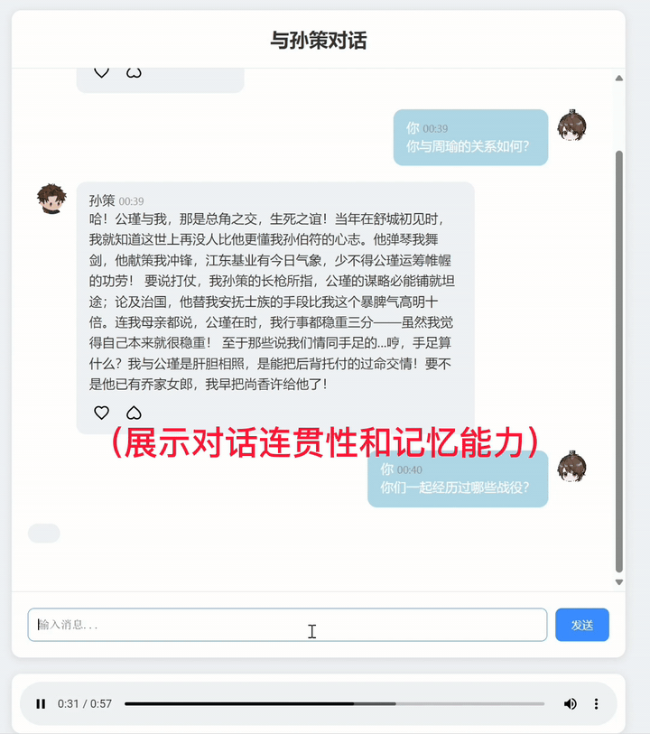

# RAG Dialogue System for Historical Character Interaction

[English](#english) · [中文](#中文)

An end-to-end historical-character dialogue prototype that combines **semantic retrieval, persona-constrained generation, and optional speech synthesis**. The system retrieves relevant source passages before answering, then turns the grounded response into a browser-based text-and-voice interaction.



## English

### Product idea

Historical role-play has two competing requirements: the character should feel expressive enough to sustain a conversation, while the model should remain anchored to the available source material. I built this prototype around that tension.

Instead of sending the user's question directly to a language model, the application first searches a vector database for relevant Sun Ce material. The retrieved passages, source and speaker metadata, persona rules, and recent conversation context are then assembled into the generation prompt. The answer can be displayed as text or passed to a local GPT-SoVITS-compatible service for speech.

### Interaction pipeline

```text
User question in the browser
          │
          ▼
Multilingual sentence embedding
          │
          ▼
Top-k vector retrieval from Weaviate / SunCeDocs
          │
          ▼
Source passages + metadata + persona constraints
          │
          ▼
DeepSeek generation through an OpenAI-compatible client
          │
          ├──► Text response in the chat interface
          │
          └──► GPT-SoVITS-compatible TTS ──► audio playback
```

### What I built

#### Retrieval layer

- Encoded user questions with `paraphrase-multilingual-MiniLM-L12-v2`, with a maximum sequence length of 512 tokens.
- Connected to a Weaviate `SunCeDocs` collection and implemented near-vector top-k retrieval.
- Preserved `text`, `source`, `sources`, `speaker`, and `relations` fields so generation receives more than an unlabelled text chunk.

#### Grounded character generation

- Wrapped DeepSeek through the OpenAI-compatible Python client and kept credentials in runtime environment variables.
- Built prompt assembly that combines retrieved evidence with identity anchors, speaking-style constraints, uncertainty handling, and the latest five dialogue turns.
- Added explicit rules for questions outside the character's lifetime and for attempts to override the assigned identity.

#### Web and audio experience

- Built the Flask application and the `/api/chat` and `/api/tts` JSON endpoints.
- Implemented the chat interface in HTML, CSS, and JavaScript, including loading feedback, message states, playback controls, and local like/dislike interaction.
- Integrated a GPT-SoVITS-compatible local endpoint, generated collision-resistant audio filenames, stored returned WAV files under Flask static assets, and played them in the browser.
- Added user-facing error states so chat and speech failures do not break the entire interface.

### Engineering choices

**Retrieval before generation.** The language model receives selected source passages before it answers. This makes the knowledge path visible in the code and keeps factual context separate from persona instructions.

**Metadata-aware context.** Source and speaker metadata are included when formatting retrieved documents. For historical dialogue, who said something and where it came from can matter as much as the passage itself.

**Persona as a controlled layer.** Historical context and character style are represented separately in the prompt. The model is asked to paraphrase source material in spoken Chinese, maintain a stable identity, avoid stage directions, and mark unsupported claims as inference rather than fact.

**Optional multimodal output.** Text chat remains the primary flow; speech synthesis is an adapter around a local service. This keeps the RAG path usable even when the TTS service is not running.

### Tech stack

| Layer | Technology | Role in the project |
|---|---|---|
| Web application | Flask | Page rendering, JSON APIs, static audio delivery |
| Retrieval | Weaviate | Vector collection and near-vector search |
| Embeddings | SentenceTransformers | Multilingual query encoding |
| Generation | DeepSeek API via `openai` client | Source-aware character response generation |
| Speech | GPT-SoVITS-compatible HTTP service | Optional Chinese voice synthesis |
| Front end | HTML, CSS, JavaScript | Chat states, feedback controls, and audio playback |
| Configuration | Environment variables | Credentials, service endpoints, ports, and local paths |

### API surface

| Endpoint | Input | Output |
|---|---|---|
| `POST /api/chat` | `{ "message": "..." }` | Generated character response |
| `POST /api/tts` | `{ "text": "..." }` | Generated WAV filename when TTS is available |
| `GET /static/audio/<filename>` | Audio filename | Browser-playable WAV asset |

### Run locally

1. Create a Python environment and install the pinned dependencies:

```bash
python -m venv .venv
# macOS/Linux: source .venv/bin/activate
# Windows:     .\.venv\Scripts\Activate.ps1
pip install -r requirements.txt
```

2. Prepare a Weaviate instance containing a `SunCeDocs` collection with the fields used by [`api/weaviate_client.py`](api/weaviate_client.py).

3. Set the runtime configuration. [`.env.example`](.env.example) lists the supported variables; the application reads them from the environment and does not automatically load the file.

```powershell
$env:DEEPSEEK_API_KEY = 'replace-with-your-key'
$env:WEAVIATE_HTTP_HOST = '127.0.0.1'
$env:WEAVIATE_HTTP_PORT = '8080'
python app.py
```

The application starts at `http://127.0.0.1:5000` by default. For speech output, also start a GPT-SoVITS-compatible service and set `TTS_API_URL` and `TTS_REF_AUDIO_PATH`.

### Prototype scope

This repository captures the complete local interaction path—from a browser question to retrieval, character response, optional synthesized speech, and playback. It is intended as an interactive RAG prototype and a foundation for further work on citation display, per-user conversation sessions, retrieval evaluation, and response-latency measurement.

---

## 中文

这是一个面向历史人物互动的 RAG 对话原型。我独立完成了从浏览器交互、语义检索、角色化生成到可选语音合成的完整链路，希望解决一个具体问题：**历史人物既要“能聊”，又不能脱离已有史料随意发挥。**

系统不会把用户问题直接交给大模型。每次对话都会先在向量数据库中检索与孙策相关的文本，再把史料片段、来源和说话人信息、角色约束以及最近的对话上下文组合进 prompt。生成结果可以直接显示为文字，也可以继续发送给本地 GPT-SoVITS-compatible 服务生成语音。

### 交互链路

```text
浏览器中的用户问题
        │
        ▼
多语言句向量编码
        │
        ▼
在 Weaviate / SunCeDocs 中执行 top-k 检索
        │
        ▼
史料片段 + 来源元数据 + 角色约束
        │
        ▼
通过 OpenAI-compatible client 调用 DeepSeek
        │
        ├──► 在聊天界面显示文字回答
        │
        └──► GPT-SoVITS-compatible TTS ──► 浏览器播放语音
```

### 我的实现

#### 语义检索

- 使用 `paraphrase-multilingual-MiniLM-L12-v2` 编码用户问题，并将最大序列长度设置为 512；
- 连接 Weaviate 中的 `SunCeDocs` collection，实现基于 query vector 的 top-k 最近邻检索；
- 在检索结果中保留 `text`、`source`、`sources`、`speaker` 和 `relations`，让生成阶段获得的不只是孤立文本块，还包括来源和人物关系信息。

#### 有史料约束的角色生成

- 通过 OpenAI-compatible Python client 封装 DeepSeek 调用，认证信息由运行时环境变量提供；
- 将检索证据、身份锚点、说话风格、未知信息处理规则和最近五轮对话组合成完整 prompt；
- 对超出人物生平时间的问题使用假设式表达，并加入身份保持规则，避免普通用户指令轻易改变角色；
- 要求模型用自然口语转述史料，不使用舞台动作或心理旁白，在没有明确史料时区分合理推测与既有事实。

#### Web 与语音体验

- 使用 Flask 搭建页面，并实现 `/api/chat` 与 `/api/tts` 两个 JSON 接口；
- 使用 HTML、CSS 和 JavaScript 完成聊天界面，包括输入状态、加载反馈、消息样式、音频播放以及本地点赞/点踩交互；
- 对接 GPT-SoVITS-compatible 本地 HTTP 服务，为每段语音生成不易冲突的文件名，将 WAV 文件写入 Flask 静态目录并返回浏览器播放；
- 为对话和语音请求加入用户可见的错误状态，使某个环节失败时页面仍能继续工作。

### 设计思路

**先检索，再生成。** 大模型回答前必须先接收相关史料片段。这样知识来源与角色表达在代码层面是两条清晰的链路，也便于继续增加引用展示和检索评测。

**保留语料元数据。** 在历史对话中，“谁说的”和“出自哪里”往往与文本本身同样重要，因此 prompt 会同时携带来源与说话人信息，而不是只拼接若干无标签 chunk。

**将人设作为受控表达层。** 史料负责提供事实背景，角色规则负责控制第一人称身份、口语风格和表达边界。两者分开组织，既能保留孙策的互动感，也能减少人设要求对事实内容的覆盖。

**语音是可选适配层。** 文本对话本身可以独立运行；TTS 只在本地服务可用时接入。这种拆分避免语音依赖阻塞核心 RAG 流程，也方便替换不同的语音服务。

### 技术栈

| 层级 | 技术 | 在项目中的作用 |
|---|---|---|
| Web 应用 | Flask | 页面渲染、JSON API、静态音频访问 |
| 向量检索 | Weaviate | 保存向量语料并执行 near-vector 查询 |
| Embedding | SentenceTransformers | 生成多语言问题向量 |
| 文本生成 | DeepSeek API + `openai` client | 根据史料与人设生成角色回答 |
| 语音合成 | GPT-SoVITS-compatible HTTP service | 可选的中文语音输出 |
| 前端 | HTML、CSS、JavaScript | 聊天状态、反馈控件和音频播放 |
| 配置 | 环境变量 | 管理认证信息、服务地址、端口和本地路径 |

### 接口

| 接口 | 输入 | 返回 |
|---|---|---|
| `POST /api/chat` | `{ "message": "..." }` | 角色化文字回答 |
| `POST /api/tts` | `{ "text": "..." }` | TTS 可用时返回生成的 WAV 文件名 |
| `GET /static/audio/<filename>` | 音频文件名 | 浏览器可播放的 WAV 文件 |

### 本地运行

1. 创建 Python 环境并安装锁定版本的依赖：

```bash
python -m venv .venv
# macOS/Linux: source .venv/bin/activate
# Windows:     .\.venv\Scripts\Activate.ps1
pip install -r requirements.txt
```

2. 准备一个包含 `SunCeDocs` collection 的 Weaviate 实例，字段与 [`api/weaviate_client.py`](api/weaviate_client.py) 中的读取逻辑保持一致。

3. 按照 [`.env.example`](.env.example) 设置运行环境变量。示例文件只说明变量名，程序不会自动加载它。

```powershell
$env:DEEPSEEK_API_KEY = 'replace-with-your-key'
$env:WEAVIATE_HTTP_HOST = '127.0.0.1'
$env:WEAVIATE_HTTP_PORT = '8080'
python app.py
```

默认访问地址为 `http://127.0.0.1:5000`。如需语音功能，还需要启动兼容的本地 TTS 服务，并设置 `TTS_API_URL` 与 `TTS_REF_AUDIO_PATH`。

### 项目范围

当前仓库展示了完整的本地交互路径：用户在浏览器提问，系统完成语义检索、角色化回答、可选语音生成和页面播放。它的定位是一个可继续迭代的交互式 RAG 原型，后续可以在现有链路上加入界面引用、按用户隔离的会话、检索质量评测和响应耗时分析。

